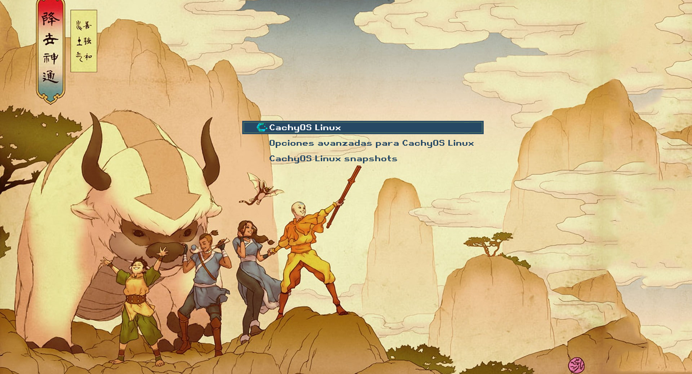

# 🌀 ATLA GRUB Theme

A clean and elegant GRUB theme inspired by Avatar: The Last Airbender, featuring full multi-resolution support (FHD, 2K, 4K).

## 🖼️ Preview / Vista previa



---

## 📥 Installation Instructions
**Step 1: Clone the theme repository**
```bash
git clone https://github.com/Gustavomagno18/ATLA-GRUB.git
```
**Step 2: Go inside the theme folder**
```bash
cd ATLA-GRUB
```
**Step 3: Make the installer script executable**
```bash
chmod +x install.sh
```
**Step 4. Run the installer script**
```bash
sudo ./install.sh
```
Select display resolution:
1) Full HD (1920x1080)
2) 2K (2560x1440)
3) 4K (3840x2160)
Enter choice [1-3]:
 
**(optional) Step 5. Update GRUB so it applies the theme (check way for your distribution)**
```bash
sudo update-grub
```
**(optional) Step 5 for Arch-distributions. Update GRUB so it applies the theme**
```bash
sudo grub-mkconfig -o /boot/grub/grub.cfg
```
---

## 💖 Support & Follow
If you like **ATLA-GRUB**, consider giving this repo a ⭐ on GitHub.  
You can also follow me for more GRUB themes and Linux customizations:  
[GitHub Profile](https://github.com/Gustavomagno18)

---

## 📜 Credits & Attribution

* **Background Artwork:** Official *Avatar: The Last Airbender* promotional illustration.
* **Source:** Downloaded via [WallpaperFlare](https://www.wallpaperflare.com/avatar-the-last-airbender-wallpaper-cyiva).
* **Font:** Retro Gaming.

> *Note: All rights to "Avatar: The Last Airbender", character designs, and original artwork belong to Nickelodeon / Paramount and creators Michael Dante DiMartino & Bryan Konietzko. This GRUB theme is a non-commercial, open-source community project distributed under the MIT License.*
